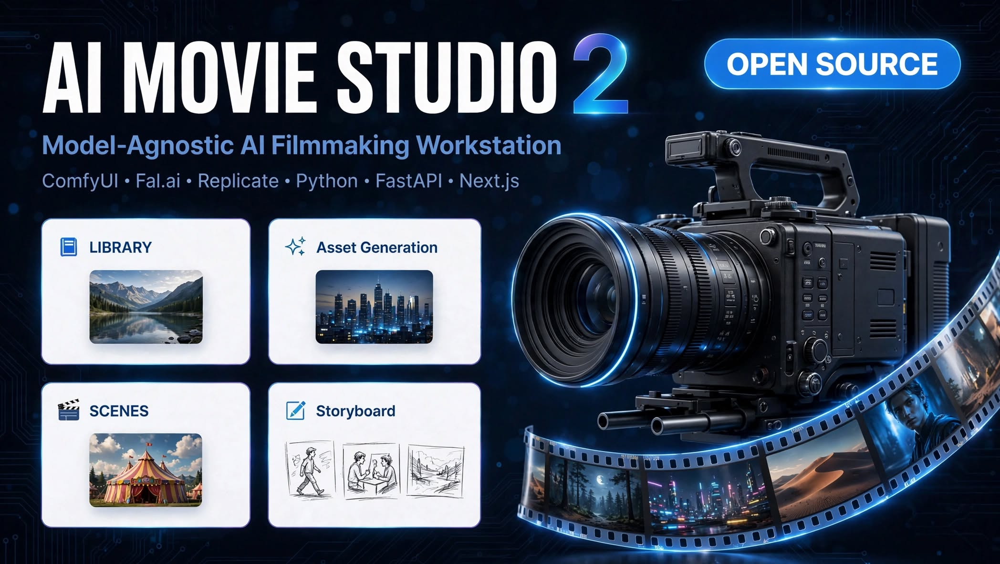
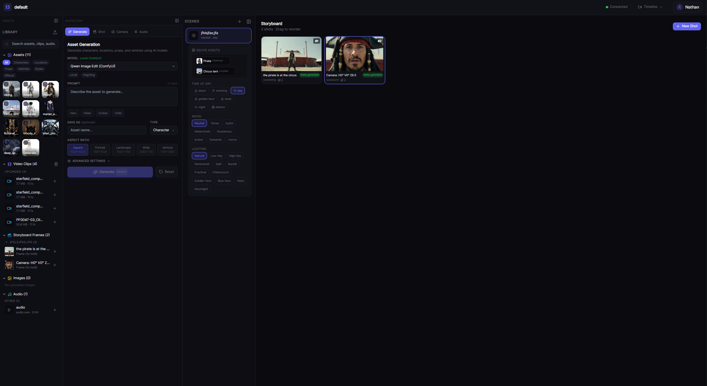

# 🎬 AI Movie Studio 2



[](https://www.python.org/)
[](https://fastapi.tiangolo.com/)
[](https://nextjs.org/)
[](https://react.dev/)
[](https://threejs.org/)
[](https://tailwindcss.com/)
[](LICENSE)

> A professional, **model-agnostic** AI filmmaking workstation. Plan scenes, generate storyboard frames, manage assets, and orchestrate AI generation through local **ComfyUI** or cloud APIs (**Fal** / **Replicate**).
>
> ⚠️ **Work in Progress** — This project is under active development. Features may change, and some pipelines are experimental. Expect breaking changes between updates.

### What is this?

AI Movie Studio 2 is a browser-based tool for AI-assisted filmmaking. Think of it as a **virtual film studio** — you design scenes, place cameras, generate storyboard frames with AI, turn them into videos, add dialogue and audio, then export the final timeline.

You don't need to be a developer to use it. If you can use a web browser, you can use AI Movie Studio. The setup below is for developers who want to run it locally or contribute.




---

## 📋 Table of Contents

- [Features](#-features)
- [Quick Start](#-quick-start-5-minutes)
- [How to Use](#-how-to-use)
- [Available Models](#-available-image-models)
- [Architecture](#-architecture)
- [Troubleshooting](#-troubleshooting)
- [Project History](#-project-history)
- [Roadmap](#-roadmap)
- [Licensing](#-licensing--commercial-use)

---

## ✨ Features

- **🗂️ Project & Asset Vault** — All your projects, scenes, shots, and assets are stored locally. No cloud dependency required.
- **🎬 3D Storyboard** — Place a virtual camera in 3D space and frame your shots visually. Drag to position, see compass directions, FOV cone, and get warnings when you break the 180° rule.
- **🧠 Continuity System** — Keep characters and locations consistent across frames using reference images.
- **🔌 Works with Any AI Model** — The "Driver System" lets you swap between local ComfyUI and cloud providers (Fal, Replicate) without changing the UI.
  - **Image generation:** 7+ local models, 7+ cloud models
  - **Video generation:** 3 local models, 4 cloud models
  - **Audio:** Fish Speech for TTS and voice cloning
- **🖼️ Multi-Reference Generation** — Feed the AI multiple character/scene reference images to maintain visual consistency.
- **🎞️ Timeline & Export** — Assemble shots into a timeline, add audio, and export to XML for editing in Premiere, DaVinci, etc.
- **⚡ Live Status** — Watch generation progress in real-time with elapsed timers.
- **🎛️ Shot Composition Tools** — Cinematic presets (establishing, over-shoulder, close-up, POV), art styles, aspect ratios, and advanced controls (negative prompt, seed, denoise, CFG, steps).
- **📸 Multi-Angle & Variations** — Generate alternate camera angles, prompt variations, and retake failed shots.
- **🔀 Shot Management** — Drag-and-drop reordering, shot duplication, next/prev navigation, keyboard shortcuts (Ctrl+Enter to generate), and a fullscreen lightbox viewer.

---

## 🏗️ Architecture

The app follows a clean **Adapter Pattern** so the frontend never knows which AI engine is running.

```
┌─────────────────────────────┐        ┌──────────────────────────────┐
│  Frontend (Next.js 14)      │  HTTP  │  Backend (FastAPI)           │
│  ├─ 3D Stage (R3F)          │ ────►  │  ├─ API Routes               │
│  ├─ Storyboard / Shots      │  WS    │  ├─ Logic (Script/Continuity)│
│  ├─ Asset Library           │ ◄────  │  ├─ Schemas (Pydantic)       │
│  └─ Zustand Store           │        │  └─ Drivers (Adapter)        │
└─────────────────────────────┘        └──────────────┬───────────────┘
                                                      │
                                ┌─────────────────────┼─────────────────────┐
                                │                     │                     │
                          ┌─────▼─────┐         ┌─────▼─────┐         ┌─────▼─────┐
                          │ ComfyUI   │         │ Fal.ai    │         │ Replicate │
                          │ (Local)   │         │ (Cloud)   │         │ (Cloud)   │
                          └───────────┘         └───────────┘         └───────────┘
```

### Directory Layout

```
AI-MovieStudio2/
├── backend/
│   ├── api/                 # FastAPI route handlers
│   │   ├── routes_assets.py
│   │   ├── routes_audio.py
│   │   ├── routes_export.py
│   │   ├── routes_generate.py
│   │   ├── routes_projects.py
│   │   ├── routes_render.py
│   │   ├── routes_scenes.py
│   │   ├── routes_shots.py
│   │   └── routes_timeline.py
│   ├── core/
│   │   ├── drivers/         # AI model adapters (the "Driver System")
│   │   │   ├── base.py              # Abstract base classes
│   │   │   ├── comfy_image.py
│   │   │   ├── comfy_video.py
│   │   │   ├── comfy_camera.py
│   │   │   ├── fal_image.py
│   │   │   ├── fal_video.py
│   │   │   ├── fish_speech.py
│   │   │   └── replicate_driver.py
│   │   ├── logic/           # Business logic (script parsing, continuity)
│   │   ├── schemas/         # Pydantic models (single source of truth)
│   │   │   ├── asset.py
│   │   │   ├── camera.py
│   │   │   ├── project.py
│   │   │   ├── scene.py
│   │   │   ├── shot.py
│   │   │   └── style_bible.py
│   │   └── workflows/       # ComfyUI workflow JSON templates
│   ├── assets/              # The Vault (project data + generated media)
│   │   ├── default/         # Default project workspace
│   │   ├── generated/       # AI-generated images & videos
│   │   └── status/          # Generation status tracking
│   ├── app.py               # FastAPI app
│   ├── main.py              # CLI entry point
│   └── requirements.txt
├── frontend/
│   ├── src/
│   │   ├── app/             # Next.js App Router pages
│   │   │   ├── project/[id] # Project workspace
│   │   │   └── projects/    # Project list
│   │   ├── components/
│   │   │   ├── studio/      # 3D stage canvas (R3F) + inspector
│   │   │   │   ├── GenerationPanel.tsx
│   │   │   │   └── InspectorPanel.tsx
│   │   │   ├── shots/       # Storyboard, shot detail & composition
│   │   │   │   ├── ShotComposer.tsx       # Main storyboard grid + drag-drop
│   │   │   │   ├── ShotCreatePanel.tsx    # New shot creation UI
│   │   │   │   ├── ShotDetail.tsx         # Shot detail with next/prev nav
│   │   │   │   ├── CameraAngleWidget.tsx  # 3D camera positioning (R3F)
│   │   │   │   ├── ShotTypeLibrary.tsx    # Cinematic preset quick-select
│   │   │   │   ├── ScenePanel.tsx         # Scene list sidebar
│   │   │   │   ├── MultiAnglePanel.tsx    # Multi-angle generation
│   │   │   │   ├── VariationPanel.tsx     # Prompt variation generation
│   │   │   │   └── RetakePanel.tsx        # Retake failed generations
│   │   │   ├── shared/      # Reusable UI components
│   │   │   │   ├── AssetPicker.tsx        # Asset selection dropdown
│   │   │   │   ├── ShotFrameLinker.tsx    # Link reference frames to shots
│   │   │   │   ├── ModelSelector.tsx      # AI model dropdown with grouping
│   │   │   │   └── Lightbox.tsx           # Fullscreen image viewer
│   │   │   ├── library/     # Asset grid & detail panel
│   │   │   ├── camera/      # Camera director (video generation)
│   │   │   ├── timeline/    # Shot timeline, dialogue & audio
│   │   │   └── export/      # Export panel
│   │   └── lib/
│   │       ├── api.ts                  # API client
│   │       ├── store.ts                # Zustand state management
│   │       ├── useGenerationPolling.ts # Reusable polling hook for async jobs
│   │       ├── useAuth.ts             # Authentication hook
│   │       └── cinematicPresets.ts    # Shot type & camera preset definitions
│   ├── next.config.mjs      # API proxy config
│   └── package.json
└── README.md
```

---

## ✅ Prerequisites

You'll need these installed before setting up the project:

- **[Python 3.10+](https://www.python.org/downloads/)** with `pip`
- **[Node.js 18+](https://nodejs.org/)** with `npm`
- **[ComfyUI](https://github.com/comfyanonymous/ComfyUI)** running locally (for AI image/video generation)
- **GPU** with CUDA support (recommended for local generation — cloud models work without one)

---

## 🚀 Quick Start (5 minutes)

> **New to this?** Follow these steps in order. You'll need **3 terminal windows** open at the same time.

### Step 1 — Install the Backend

```bash
cd backend
pip install -r requirements.txt
```

Create a `.env` file in the `backend/` directory:

```env
# Required for local generation
COMFY_URL=http://127.0.0.1:8188

# Optional — only needed if using cloud AI models
FAL_KEY=your_fal_api_key
REPLICATE_API_TOKEN=your_replicate_token
```

> 💡 Don't have API keys? You can skip the cloud lines and use local ComfyUI only.

### Step 2 — Install the Frontend

```bash
cd frontend
npm install
```

### Step 3 — Start ComfyUI

ComfyUI is the AI engine that generates images and videos. Start it in its own terminal:

```bash
cd /path/to/ComfyUI
python main.py
```

> ⚠️ **Flash Attention warning on older GPUs?** Force SDPA mode:
> ```powershell
> $env:ATTN_BACKEND="sdpa"  # Windows PowerShell
> python main.py
> ```

### Step 4 — Start the Backend

In a second terminal:

```bash
cd backend
python main.py serve --reload
```

You should see the API running at http://localhost:8001. Check http://localhost:8001/health to confirm.

### Step 5 — Start the Frontend

In a third terminal:

```bash
cd frontend
npm run dev
```

Open **http://localhost:3000** in your browser. You're ready to go! 🎬

---

## ▶️ Running the App (Day-to-Day)

Once everything is installed (see Quick Start above), you just need to start the 3 services each time:

| Terminal | Command | URL |
| -------- | ------- | --- |
| 1 — ComfyUI | `python main.py` | http://localhost:8188 |
| 2 — Backend | `python main.py serve --reload` | http://localhost:8001 |
| 3 — Frontend | `npm run dev` | http://localhost:3000 |

> 💡 The backend also has an interactive API explorer at http://localhost:8001/docs

---

## 🧭 How to Use

Once the app is running in your browser:

1. **Create a project** — Click "New Project" or select an existing one.
2. **Build scenes** — In the left sidebar, create scenes and add reference assets (characters, locations, props). These form the "recipe" the AI uses to keep your film consistent.
3. **Create shots** — Click "New Shot" within a scene. The first shot is auto-established (wide shot). Subsequent shots open the **3D camera widget** where you can:
   - Drag the camera around the subject in 3D space
   - Use sliders for precise horizontal/vertical angle and zoom
   - See compass directions, FOV cone, and previous shot angles
   - Get warnings if you cross the 180° line
4. **Pick a preset** — Choose from cinematic presets (establishing, over-shoulder, close-up, POV, etc.) or position the camera manually.
5. **Generate frames** — Click "Create & Generate" (or press Ctrl+Enter). The AI creates a storyboard frame using your scene's reference images.
6. **Refine** — Click any shot to open its detail panel where you can:
   - Generate alternate camera angles
   - Create prompt variations
   - Retake failed generations
   - Navigate between shots with next/prev buttons
7. **Reorder & duplicate** — Drag shot cards to reorder them. Use the duplicate button to experiment with different prompts.
8. **Generate video** — Switch to the Camera Director tab to turn frames into video clips (text-to-video or image-to-video with camera movement).
9. **Assemble & export** — Arrange shots on the timeline, add dialogue and audio, then export to XML for your editing software.

---

## 🎨 Available Image Models

| Model ID            | Display Name                | Type                          |
| ------------------- | --------------------------- | ----------------------------- |
| `z_image`           | Z-Image (ComfyUI)           | Text-to-image, 9 steps        |
| `qwen_image`        | Qwen Image (ComfyUI)        | Text-to-image, 20 steps       |
| `qwen_image_edit`   | Qwen Image Edit (ComfyUI)   | Image-to-image, 4 steps       |
| `qwen_multiangle`   | Qwen Multiangle (ComfyUI)   | Multi-reference, multi-angle  |
| `flux2`             | Flux 2 (ComfyUI)            | Text-to-image                 |
| `flux2_kontext`     | Flux 2 Kontext (ComfyUI)    | Multi-reference storyboard    |
| `krea2`             | Krea 2 (ComfyUI)            | Text-to-image                 |
| `fal_nano_banana`   | Nano Banana (Fal.ai)        | Text-to-image (cloud)         |
| `fal_krea`          | Krea (Fal.ai)               | Text-to-image (cloud)         |
| `fal_flux_dev`      | Flux Dev (Fal.ai)           | Text-to-image (cloud)         |
| `fal_flux_2`        | Flux 2 (Fal.ai)             | Text-to-image (cloud)         |
| `replicate_metaai`  | MetaAI (Replicate)          | Text-to-image (cloud)         |
| `replicate_flux_schnell` | Flux Schnell (Replicate) | Text-to-image (cloud)       |
| `replicate_sd_xl`   | SDXL (Replicate)            | Text-to-image (cloud)         |

> 💡 Cloud drivers only appear in the dropdown when the corresponding API key is set in `.env`.

---

## 🎬 Available Video Models

| Model ID              | Display Name              | Type                          |
| --------------------- | ------------------------- | ----------------------------- |
| `ltx_video_2_3`       | LTX Video 2.3 (ComfyUI)   | T2V, I2V, first-last frame    |
| `wan_video`           | Wan Video (ComfyUI)       | T2V, I2V, first-last frame    |
| `minimax_h3`          | MiniMax H3 (ComfyUI)      | T2V, I2V, reference-to-video  |
| `fal_seedance`        | Seedance v1 (Fal.ai)      | T2V, I2V, camera control      |
| `fal_seedance_2`      | Seedance 2 (Fal.ai)       | T2V, I2V, camera control      |
| `fal_seedance_2_5`    | Seedance 2.5 (Fal.ai)     | T2V, I2V, camera control      |
| `fal_minimax_h3`      | Minimax H3 (Fal.ai)       | T2V, I2V                      |

> 💡 Local video models require ComfyUI with the appropriate custom nodes installed. Cloud models require `FAL_KEY`.

---

## 🔊 Available Audio Models

| Model ID        | Display Name    | Type                          |
| --------------- | --------------- | ----------------------------- |
| `fish_speech`   | Fish Speech     | TTS, voice cloning            |

---

## 🧩 How the Driver System Works

The app is **never hard-coded to one AI model**. Instead, it uses "Drivers" — small adapter modules that all speak the same interface. This means you can swap from local ComfyUI to cloud Fal.ai without touching the UI.

```
Frontend dropdown → Backend API → Driver Registry → ComfyUI / Fal / Replicate
```

Want to add a new model? Just add a new Driver. No frontend changes needed:

```python
# backend/core/drivers/base.py  (conceptual)
class ImageDriver(ABC):
    @abstractmethod
    async def generate(self, prompt: str, references: list[bytes], **opts) -> bytes: ...
```

---

## 🛠️ Troubleshooting

**Generation status not updating**
- Ensure the backend was restarted after code changes.
- Check that ComfyUI is running and accessible at the `COMFY_URL`.

**403 Forbidden on generated images**
- The backend downloads images from ComfyUI and serves them locally.
- Verify `backend/assets/generated/` exists and is writable.

**Slow generation**
- Force SDPA attention backend: `$env:ATTN_BACKEND="sdpa"` (PowerShell).
- Use turbo/lightning models (Z-Image Turbo = 9 steps, Qwen Edit Lightning = 4 steps).
- Reduce resolution if needed.

**Frontend can't reach API**
- Backend must be on port 8001 (configured in `next.config.mjs`).
- Check http://localhost:8001/health responds.

**3D camera widget not appearing / WebGL error**
- The 3D widget requires a WebGL context. If it fails, a slider-based fallback is shown automatically.
- Close other browser tabs using WebGL (maps, games, other dev sessions) — browsers limit concurrent contexts (~16).
- Enable hardware acceleration in your browser settings and restart.
- A hard refresh (Ctrl+Shift+R) or fresh tab often fixes context exhaustion from hot reloads.

---

## � Project History

This project began as an ambitious AI filmmaking tool over a year ago. The original version packed in every feature imaginable — but the interface became cluttered, the workflow was hard to navigate, and the tooling overhead outweighed the creative benefits. Rather than patching the old codebase, I started over from scratch with a clear goal: **a clean, focused UI with a streamlined creative flow.** This is version 2 — simpler, faster, and built around the actual filmmaking workflow rather than a kitchen-sink feature list. Additional tools like inpainting will be added once they fit naturally into the flow.

---

## �🗺️ Roadmap

- [ ] Inpainting & masking tools
- [ ] PostgreSQL migration for the Vault
- [ ] Video timeline preview & scrubbing
- [ ] Voice cloning / lip-sync pipeline
- [ ] Cloud-only mode (no local ComfyUI required)
- [ ] Multi-user project sharing

---

## ⚖️ Licensing & Commercial Use

This project is open-source and licensed under the **GNU Affero General Public License v3.0 (AGPLv3)**.

### For Individuals and Open-Source Developers:
You are free to use, modify, and share this software completely for free, provided that any derivative work or hosted service you build with it is also fully open-sourced under the AGPLv3.

### For Commercial Entities & Businesses:
If you want to use this software, modify it, or embed it into a proprietary commercial product without being forced to open-source your own code, **the AGPLv3 license does not permit this**.

We offer **Commercial Licenses** for enterprise use, white-labeling, and closed-source integrations. Please contact nathan.mcconnell@sandboxentmt.com to discuss commercial licensing terms.
